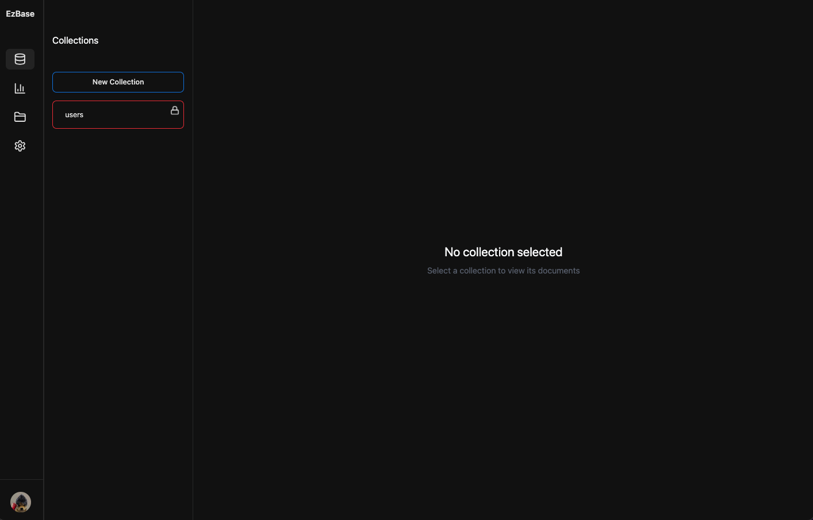
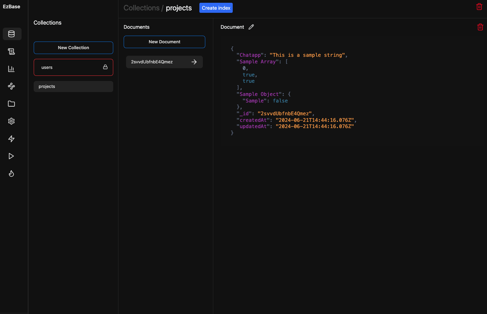
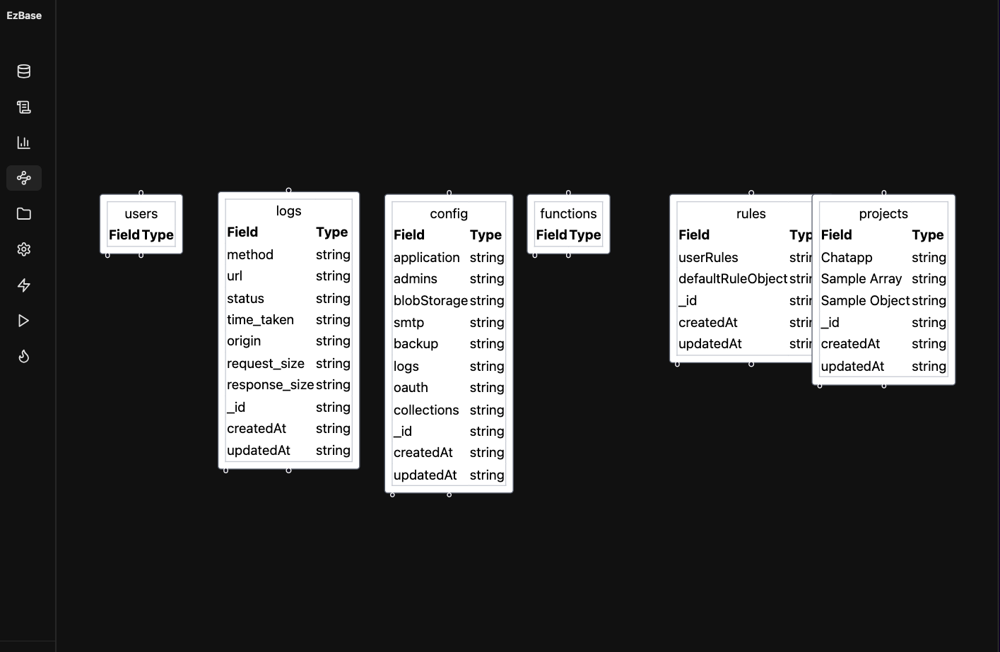
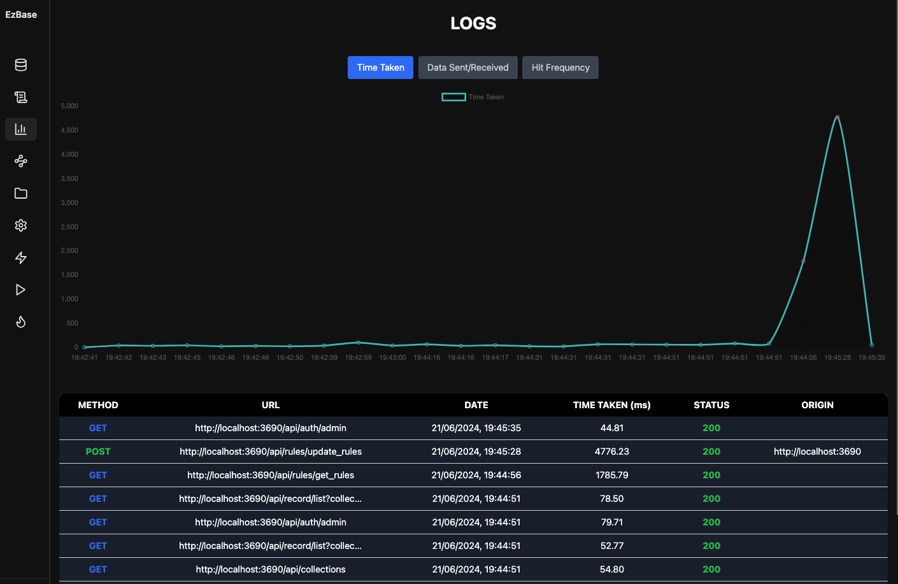
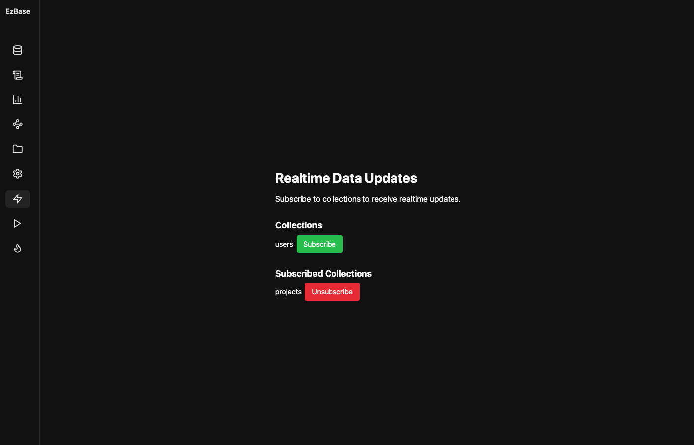
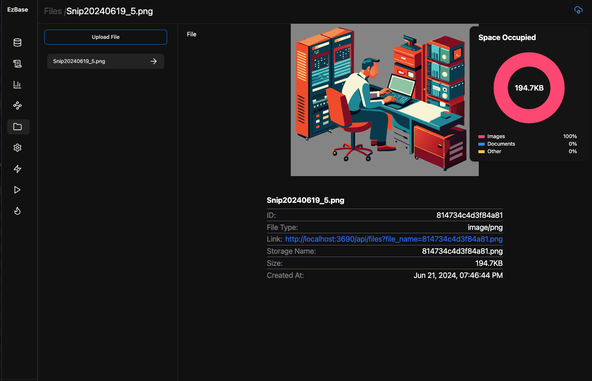
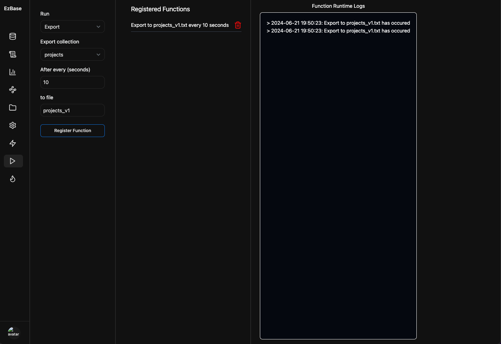
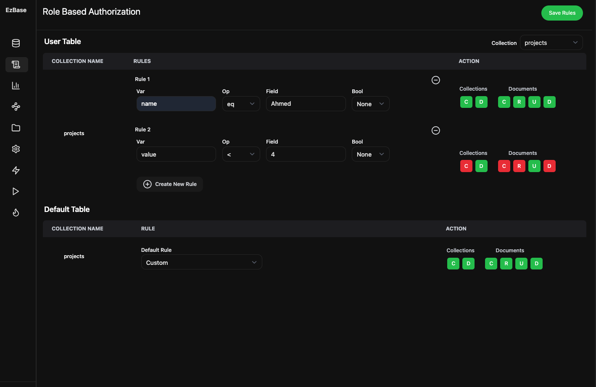

# Ezbase

Ezbase is an Opensource Backend for the Web, implemented in Typescript and was created as a University Final Year Project.

Ezbase provides the following features:
- CRUD operations with the embedded NoSQL database: NeDB
- Ability to automatically create NoSQL schemas as the Collection and document structures change.
- View API usage logs with graphs
- Admin Dashboard
- Realtime Database
- Cloud Functions (Currently built in functions like exporting Collections are supported)
- File Storage System
- Cloud File Storage support with Azure
- SMTP Email Settings
- Authentication support and OAuth adapters
- Simple Role-Based Access Control with UI for NoSQL collections





Table of Contents:

- [Installation](#installation)
  - [Linux](#linux)
  - [Windows](#windows)
  - [MacOS](#macos)
- [Getting Started](#getting-started)
- [SDK](#sdks)
- [Docs](#docs)
- [Showcase](#showcase)
  - [CRUD](#crud)
  - [Schema Generation](#schema-generation)
  - [Logs](#logs)
  - [Realtime-Database](#realtime-database)
  - [File-Storage](#file-storage)
  - [Role Based Access Control](#role-based-access-control)
- [Contributing](#contributing)
- [Final Notes](#final-notes)
  
[//]: <> (-Architecture diagram)

## Installation

Ezbase is designed to run as an executable and is compatible with Linux, Windows and MacOS. With just one click you can start the backend and use the service.

### Linux

1. Under the Releases Tab of this Github Repository, click on Ezbase-V1.
2. Download `ezbase_linux.zip`
3. After installing, unzip `ezbase_linux.zip`
4. Open terminal and type

``` ./ezbase ```

to initialise and execute the project.

### Windows

1. Under the Releases Tab of this Github Repository, click on Ezbase-V1.
2. Download `ezbase_windows.zip`
3. After installing, unzip `ezbase_windows.zip`
4. Click on `ezbase.exe` to initialise and execute the project.


#### Macos

1. Under the Releases Tab of this Github Repository, click on Ezbase-V1.
2. Download `ezbase_mac.zip`
3. After installing, unzip `ezbase_mac.zip`
4. Open terminal and type

``` ./ezbase ```

to initialise and execute the project.


## Getting Started

Once the executable is downloaded, navigate to the generated link in the terminal. This will open the Admin Dashboard. Register and Login on the Admin Dashboard to use its functionality.

On your Web project's frontend install the SDK and link the server URL as given in the documentation.

You are now ready to begin your project development using Ezbase.

### SDKs

Currently the SDK is only supported for the Web and React-Native

The SDK can be found and downloaded [here](https://www.npmjs.com/package/ezbase-ts)

## Docs

The Documentation is currently in development however it can be found [here](https://ezbase.vercel.app/docs/intro)

## Showcase

This is a showcase of the Admin Dashboard of our Project

### CRUD



### Schema-Generation



### Logs



### Realtime-Database



### File-Storage



### Functions



### Role-Based-Access-Control




## Contributing

We would really appreciate Contributions! Every contribution will go through heavily checked Pull Requests.

The Project will soon be migrated to our organization page where formal development will occur. However this repository serves as a good example on how the development of a future stable version of Ezbase will look like.

Star the project and follow us at [Ezbase Organization](https://github.com/ez-base) for future developments on the project.

## Final-notes

- If in case you may be wondering what p06 refers to, p06 was our group ID for our FYP.
- The project initially started out in Rust but due to time constraints of our degree, it was migrated to Typescript. However in the near future, the backend will be migrated again to C or Zig (which will be the final migration).
- Any future developments will take place on [Ezbase Organization](https://github.com/ez-base)
- To contact us, feel free to reach out on our email: ezbasefoundation@gmail.com
- The project is in heavy development and is not stable. Please note, there maybe sever bugs in the project.
